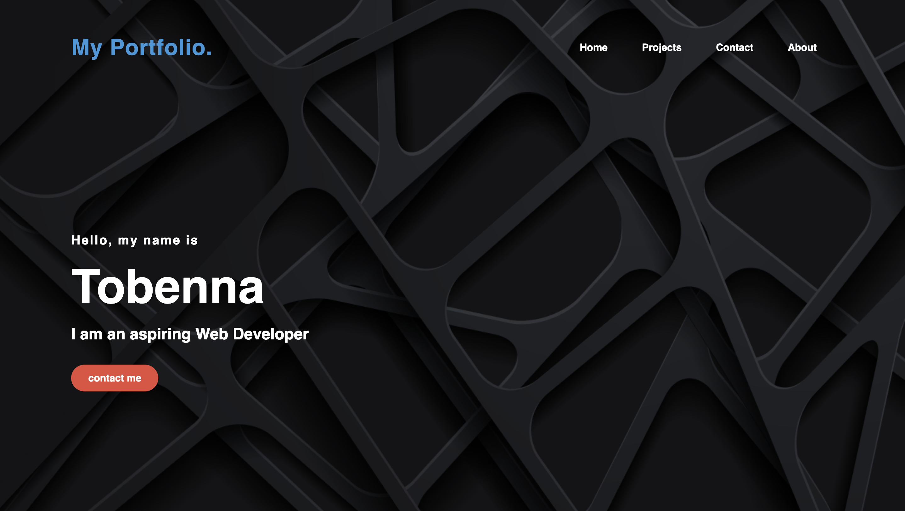

# My Portfolio

This is my personal portfolio website showcasing my skills and projects.

## Table of Contents

- [Introduction](#introduction)
- [Features](#features)
- [Usage](#usage)
- [Project Structure](#project-structure)
- [Contact](#contact)
- [Screenshot](#screenshot)

## Introduction

Welcome to my portfolio! This website is a representation of my journey as a bootcamp student in web development. It serves as a platform to display my skills, projects, and a brief introduction to who I am as an aspiring web developer.

## Features

- Hero section with a brief introduction.
- About section with a short description of my skills and background.
- Projects section showcasing some of my work.
- Contact section with links to reach out to me.

## Usage

1. **Explore:** Feel free to navigate through the various sections of the website.
2. **Projects:** Check out the projects I've worked on by clicking on the images in the Projects section.
3. **Contact:** Connect with me via the provided email or LinkedIn links in the Contact section.

## Project Structure

- `index.html`: The main HTML file that structures the content.
- `style.css`: The CSS file for styling the website.
- `Assets/`: Directory containing images used on the website.
- `reset.css`: A CSS reset or normalization file to standardize styles across browsers.
- `README.md`: You are currently reading it!

## Contact

- Email: [tvokafr@gmail.com](mailto:tvokafr@gmail.com)
- LinkedIn: [My LinkedIn Profile](https://www.linkedin.com)

## Screenshot

- 
